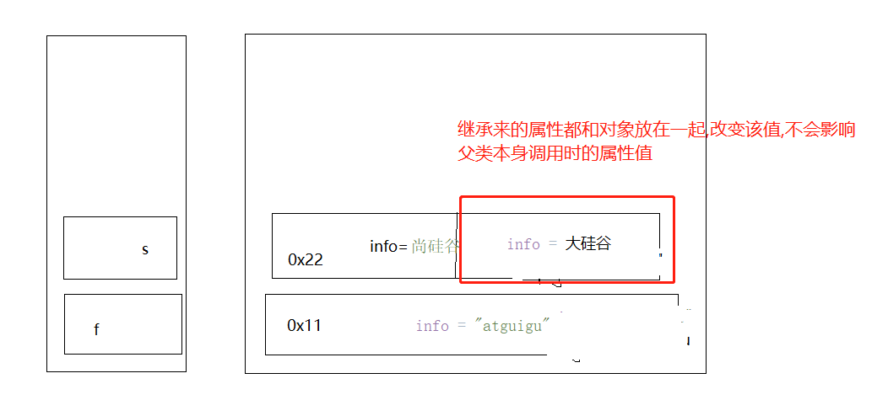

# 1.重载
```java
方法名相同,参数列表不同,与返回值类型和修饰符无关
```

# 2.重写
```java
1.方法名相同,参数列表相同,
2.修饰符权限大于等于父类,
3.返回值类型,如果是基本数据类型,必须一致,
如果是引用数据类型,与父类返回值类型一致,或者可以是父类或子类

4.异常  子类不能抛出比父类更大的异常 （了解）*****


注意:
     静态方法不能被重写
```

# 3.
```java
成员变量的初识化方式：
1.默认初始化
    byte short int long 0
    float double  0.0
    boolean false
    char \u0000
    引用类型数据  null  String  数组  类
2.显示赋值
    成员变量后直接写值
    int age  =20;
3.构造器赋值
     public Person(String name, int age) {
        this.name = name;
        this.age = age;
    }
4.代码块
    {}：代码块
    静态代码块： *****
    static {}
        作用： 给静态成员变量赋值
        可以将进行初始化内容放到静态代码块内
        注意： 无论创建几次对象 静态代码块都只执行一次

        成员代码块: *
        类中方法外  成员变量位置一致
        给成员变量赋值
        注意： 创建几次对象 成员代码块就会执行几次    
```

# 4.类的初始化
```java
<clinit>:类的初始化 编译器自动调用的方法
        会将 静态成员变量的显示赋值语句
            静态代码块中的 内容进行合并
哪些操作会触发类的初始化：
    1.在当前类中调用main（）
    2.调用本类中的静态资源
    3.创建该类对象会触发
    4.调用子类中的静态资源 会导致父类初识化

注意：
    1.子类使用从父类继承的静态资源时 不会导致子类初始化
    2.父子类进行类的初始化 也只是调用一个 <clinit>方法
    3.只创建父类对象,不会导致子类被类初始化
    4.如果父类有静态方法,同时子类也有静态方法,则父类的静态方法会被隐藏
```

# 5.实例初始化
```java
实例初始化：类中非静态成员变量赋值

实例初始化4个：
    1.super()

    2. 类中非静态成员变量显示赋值语句
    3. 非静态代码块
    4.构造器中的内容

注意：
    1.创建多次对象 实例初始化会执行多次
    2.实例初始化执行的方法 init()
    3.当有继承关系时  父类和子类会有单独的 <init>进行实例初始化
    4.当 子类重写了父类的方法时   查看是否会调用父类的资源
```

# 6.继承(待定)
```java
1.子类继承父类所有的非私有的属性和方法,包括静态属性和静态方法
IDEA语法提示,不提示对象.静态方法和属性,但是直接写确实是,可以打印出来的

2.如果父类的属性是私有的,可以通过继承过来的setter/getter获取属性

3.如果子类中重写了父类的方法,那么子类调用的就是子类的重写方法,

4.父类中的静态方法,会被子类中的同名静态方法隐藏

```

