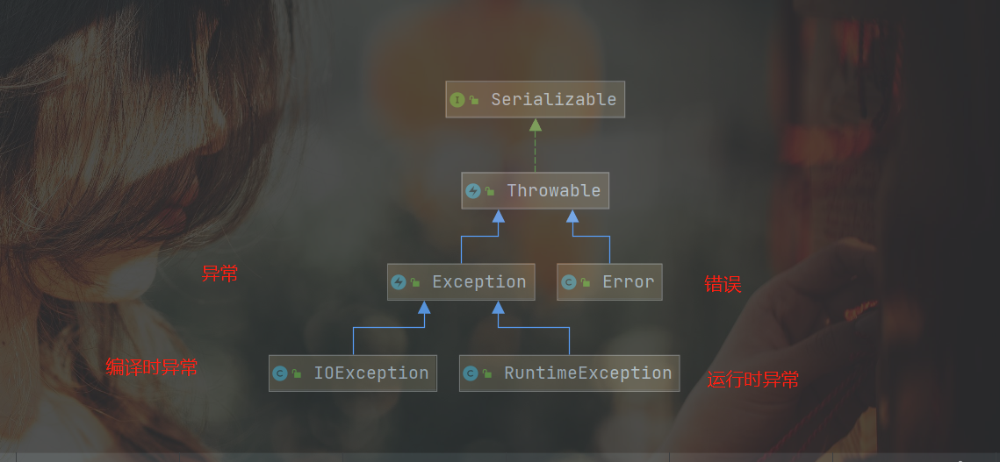

# 异常的三种处理方式

```java
1.向上抛出,在方法出声明,不处理
	
	private static void show() throws NullPointerException{}
2.手动抛出异常后,不需要在方法处声明,不处理
	throw new NullPointerException("数字为空");

3.自行处理try{}catch{}finally{}

	private static void show(){
        String b = null;
        int a = 10;
        try {
            b.equals("sss");
            System.out.println(a);
            System.out.println("异常后执行");
        } catch (Exception e) {
            e.printStackTrace();
            a = 20;
            System.out.println(a);
            return a;
        } finally {
            a = 30;
            System.out.println(a);
            return a;
        }
    }

注意点:
	1.如果使用了try catch
      不管是否发生异常,finally块都执行
    2.如果发生了异常,异常后的代码不执行,同时跳转到catch块中
     从finally处结束
    3.catch块中的异常类可以用|标识多个
    	catch ( NullPointerException | InputMismatchException e) {}
		但是常用异常的父类表示
		catch (Exception e) {}
	4.也可以使用多个catch块
		try {
        }catch ( NullPointerException  e) {
        }catch (  InputMismatchException e) {
        }


```

# 自定义异常

```java
1.继承任意一种需要的异常父类,常用运行时异常和检查异常
2.生成带参构造方法
public class Test3 extends NullPointerException {
    public Test3(String s) {
        super(s);
    }
}
3.使用自定义异常类
throw new Test3("自定义异常类");
```

# 异常的继承树



