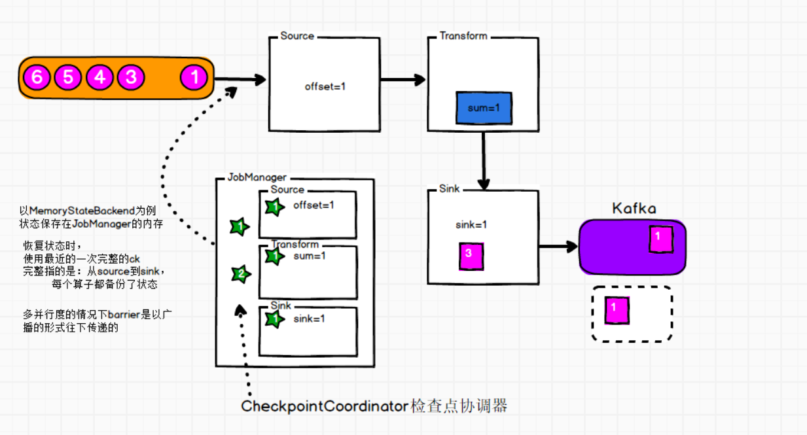
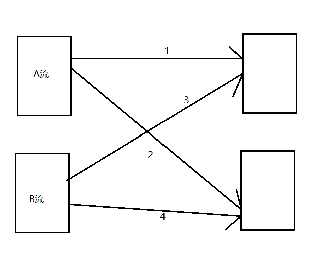

# 	1.session-cluster
    特点:需要提前启动flink集群,提前向yarn申请一定的资源,并且常驻,以后的任务都向这里提交
    
    优点:适用于需要频繁提交的小job,并且执行时间都不长,
    
    缺点:如果提交的作用有需要长时间作业的大job,则会占用该flink的所有资源,后续的job则无法继续提交


    使用方式:
    1.bin/yarn-session.sh -d   (提前启动一个flink集群)
    2.bin/flink run -c 全类名 jar(如果不指定yarn-session集群,会自动寻找也可以使用Dyarn.application.id=application_XXXX_YY 指定启动的flink集群)

# 2.per-job-cluster
    特点:每次提交job,都会重新向yarn申请资源,创建一个新的flink集群,并且任务结束后释放资源,不会影响别的job的执行
    
    优点:适用于需要长时间作业的大job
    缺点:每次提交job都会申请和释放资源,会占用一定的时间
    
    生产环境中使用:per-job-cluster
    
    使用方式:
    bin/flink run -d -t yarn-per-job -c 全类名 jar 
    
    提交任务到其他队列
    bin/flink run -d -m yarn-cluster -yqu hive -c 全类名 jar(旧版提交)
    
    bin/flink run -d -t yarn-per-job -Dyarn.application.queue=hive -c 全类名 jar(新版提交)
# 3.Application-mode-cluster
    原理与per-job-cluster一样
    区别:Application-mode-cluster的main函数执行在集群上
    
    使用方式:
    bin/flink run-application -t yarn-application -c 全类名 jar
    
    提交任务到其他队列
    bin/flink run-application -t yarn-application -Dyarn.application.queue=hive -c 全类名 jar


# 4.yarn模式高可用和standalone高可用的区别
```
区别:
yarn模式:只启动一个,当他挂了,yarn会在别的节点上再次启动一个
standalone模式:同时启动多个JobManager,一个为leader,其他的为standby,leader挂掉,其他的中一个会成为leader

yarn模式高可用的原理:
在yarn-site.xml设置的是尝试次数(上限),flink-conf.xml中的值应该小于他,只有在一定的时间内尝试次数大于设置的上限时,才会真正挂掉  
```

 

# 5.flink架构组成
```
客户端
JobManager:程序的主进程
    ResourceManager:flink资源的管理者
    Dispatcher:接收用户提交的作业,为新的作业启动一个JobMaster,该组件不是必须的,取决于应用提交的方式
    JobMaster:每个job任务的老大
TaskManager:flink的工作进程,每个TaskManager包含了多个slots,slots的数量限制能够执行的任务数量
```


# 6.job提交流程


# 7.核心概念

## 7.1 TaskManager和slots

```
TaskManager:flink中每一个worker就是一个taskManager,可以执行多个task

slot:内存资源的子集,每个taskManager至少有一个slot,多个slot平分taskManager管理的内存资源,但是他们共享一个cpu
注意点:
	1.slot在job内部可以共享,因为计算任务是一步一步执行的
	2.slot会平分taskManager的内存资源,从而达到内存隔离的作用,但是cpu是共享的
```

##  7.2 Parallelism(并行度)


```
1.一个任务的并行度等于这些所有算子中最大的并行度
2.如果空闲的slot个数小于并行度个数,那么任务就会阻塞,一直处于create的状态,除非满足了资源才会继续进行
3.并行度的优先级
算子指定>env全局设置>提交参数>配置文件
```


<p style="color:red;">注意:socket stream有且只有一个并行度</p>

## 7.3 Task与subTask


```
原来的流程是  socket->flatMap->Map->sum->print  四个task,但是经过任务链的优化变成了
socket->flatMap->map  sum->print 变成了只有两个task
```

<p style="color:red;">注意:一个并行度的蓝框等于一个task</p>

## 7.4 任务链

```
stream在算子间的传输数据形式分两种:one-to-one,redistributing

one-to-one:只要满足一进一出,不涉及分区的都属于这种形式,而且并行度必须相同,如果并行度不同也不能分到同一个subTask中

redistributing:设置到重新分区的都是数据这种形式,这种形式无法单独为这种类型的算子设置并行度
```

```
任务链的操作
	算子.startNewChain() --> 与前面的断开链接
	算子.disableChaining() --> 前后都断开链接
	env.disableOperatorChaining() -->全局所有算子都不进行链接
```


```
任务链的优缺点
	优点:减少了线程间的切换,与数据间的交换,减少的数据延迟的同时提升了吞吐量
		例如: 一个任务2个并行度 A 线程执行flatMap B线程执行map
		在A线程执行完flatMap后需要将数据交换给B线程继续进行计算,使用任务链,就可以避免这种操作,直接由A线程操作完flatMap之后直接继续操作Map算子
		
	缺点:如果在链接中的算子中,有一个算子的压力特别大,会拖累在任务链中的其他算子,此时就可以将这个算子单独断链,成为单独的一个,减小整体的压力	
	
```

```
共享组
	默认只有一个共享组,在共享组内共享slot,所有slot的个数等于最大并行度
	
使用 算子.slotSharingGroup("group1")会开辟新的共享组,此时slot的个数等于多个共享组,各个共享组最大并行度之和

例如:两个共享组,每个共享组的最大并行度为1  那么slot的个数为1+1=2
```


## 7.5 执行图


# 8.自定义算子和source函数时,关注富函数

```java
//什么叫富函数:包含声明周期方法的抽象方法,普通函数不含有声明周期方法

//以FlatMap算子为例:
public abstract class RichFlatMapFunction<IN, OUT> extends AbstractRichFunction implements FlatMapFunction<IN, OUT>
    
//自定义flatMap 富函数
public static class MyFlatMapFunction extends RichFlatMapFunction<String,String>{
    
    @Override
    public void open(Configuration parameters) throws Exception {
        System.out.print("open......")
    }
    
    @Override
    public void flatMap(String value, Collector<String> out) throws Exception {
        String[] list = value.split(" ");
        for (String word : list) {
            out.collect(word);
        }
    }
    
    @Override
    public void close() throws Exception {
        System.out.print("close......")
    }
} 
```

```
注意点:
	1.每个并行实例都会执行声明周期方法,一个并行度执行一次open,close  两个并行度执行两次open
	2.读文件时 会执行两次close 一次open
	3.富函数中独有的方法getRuntimeContext()可以获得累加器等参数
```


# keyBy算子

```
keyBy算子经过了两次hash
	第一次 key.hashCode()作为参数传入computeKeyGroupForKeyHash(int keyHash)
	第二次 MathUtils.mumurHash(keyHash) % maxParallelism
	
默认最大	maxParallelism为 
```

# process

```
在没keyBy之前调用的是new ProcessFunction(....)
经过keyBy之后调用的是new KeyedProcessFunction(....)
```

# Redis-Sink

```maven
 <dependency>
    <groupId>org.apache.flink</groupId>
    <artifactId>flink-connector-redis_2.11</artifactId>
    <version>1.1.5</version>  //此处版本不是flink的版本而是bahir的版本
</dependency>

```


# 9.执行模式

```
三种执行模式:
	BATCH:批处理,仅用于有界数据
	STREAMING(默认):即可也以用在有界数据,也可以用在无界数据
    AUTOMATIC:自动选择
    
配置方式:
	1.代码设置
	env.setRuntimeMode(RuntimeExecutionMode.BATCH);
	2.命令行设置
	bin/flink run -Dexecution.runtime-mode=BATCH 
	
推荐使用命令行设置,更加灵活	
```

```
有界数据使用 STREAMING和BATCH的区别
 STREAMING:会打印每一次的结果
 BATCH:没有中间过程,直接输出最终结果
```


# 10.flink 窗口->所有的窗口必须在keyBy之后使用

## 10.1 基于时间的窗口

### 1.滚动窗口

```
1.每个数据只属于一个窗口
2.窗口之间没有缝隙
3.窗口的长度固定
4.时间范围[ )
5.窗口的开启和关闭时间对齐

示例:.window(TumblingProcessingTimeWindows.of(Time.seconds(8)))
```


### 2.滑动窗口

```
1.滑动步长如果小于时间间隔,那么窗口会重叠
  滑动步长如果等于时间间隔,那么就等于滚动窗口
  滑动步长如果大于时间间隔,那么窗口之间就会有缝隙,代表会丢数据
2.一般滑动步长小于窗口大小
3.窗口的开启和关闭时间对齐

示例: .window(SlidingProcessingTimeWindows.of(Time.seconds(10), Time.seconds(5)))
```


### 3.会话窗口

```
1.窗口的开启和关闭时间不对齐
2.窗口之间一定有间隔
3.窗口设置的时间间隔是代表着没有数据输入的时间间隔
4.如果在时间间隔内没有数据输入窗口就会关闭
5.每次数据输入都会重置会话窗口的关闭时间

示例:
	1.静态gap .window(ProcessingTimeSessionWindows.withGap(Time.seconds(10)))
	2.动态gap 
	.window(ProcessingTimeSessionWindows.withDynamicGap(new SessionWindowTimeGapExtractor<Tuple2<String, Long>>() {
    @Override
    public long extract(Tuple2<String, Long> element) { // 返回 gap值, 单位毫秒
        return element.f0.length() * 1000;
    }
}))

```

## 10.2 基于元素个数的窗口

### 1.滚动窗口

```
1.只要元素个数达到设置的值,就触发计算,关闭窗口

示例:.countWindow(3)
```

### 2.滑动窗口

```
1.只有两次相同的key才会触发计算

示例:.countWindow(3,2)
```


## 10.3全局窗口

```
1.只有相同的key才会被分入同一个全局窗口,
2.需要自定义触发器,否则不会触发计算

示例:.window(GlobalWindows.create());
```

## 10.4 no keyed window

```
不需要keyed的窗口只有 windowall,他的并行度只能是1,就算设置的不是1,也只会使用1个并行度

```

## 10.5 窗口源码解析

```
1.offset与开窗闭窗的时间,其中offset默认为0
staggerOffset = windowStagger.getStaggerOffset(context.getCurrentProcessingTime(), size)
staggerOffset:计算后固定返回值为0L

TimeWindow.getWindowStartWithOffset(now, (globalOffset + staggerOffset) % size, size)
(globalOffset + staggerOffset) % size:(offset+0L)%size

开窗时间:timestamp - (timestamp - offset + windowSize) % windowSize
闭窗时间:
	new TimeWindow(start, start + size) 
	maxTimestamp(){return end -1} //这里的1是1ms
所以开窗范围是[,)

例如:我当54秒的时候第一条数据进来,计算开窗时间,窗口大小为5
如果offset为0
54-(54-0+5)%5=54-4=50
也就是窗口的时间范围为[50,55)
如果offset为1
54-(54-1+5)%5=54-3=51
也就是窗口的时间范围为[51,56)
如果offset为-1
54-(54-(-1)+5)%5=54-0=54
也就是窗口的时间范围为[54,59)
如果offset为-4
54-(54-(-4)+5)%5=54-8=46
也就是窗口的时间范围为[46,51)[51,56)

总结:
	1.窗口创建时间默认是以格林威治时间 0时区计算,如果要开全天的窗口,必须设置offset为Times.hours(-8)
	2.offset默认为0,所以开窗时间默认是第一条数据进来时的前一个5的整倍数的时间 
	54 进来也就是50开窗,59进来也就是50开窗
	3.开窗时间计算时为什么在取模时要加上windowSieze,
	因为计算机诞生的时间取的是1970.1.1 0点0分,要确保设置offset时,不会使这个开窗时间超过计算机的诞生日期
	在计算开窗时间前,Math.abs(offset) >= size就确保了windowSize - offset>o
	4.如果设置offset不为0,其实就是为了设置开窗时间不是10的整倍数,为了开出[52,56)这种窗口
	
```

## 10.6 增量聚合函数

```
.reduce(new ReduceFunction<Tuple2<String, Long>>() {})
特点:不会改变结果的数据类型

.aggregate(new AggregateFunction<Tuple2<String, Long>, Long, Long>() {})
特点:会改变结果的数据类型
```

## 10.7 全窗口聚合函数

```
.process(new ProcessWindowFunction<Tuple2<String, Long>, Tuple2<String, Long>, String, TimeWindow>() {})

apply(new WindowFunction<Tuple2<String, Long>, Long, String, TimeWindow>() {})

两种方式
```

## 10.8 全窗口聚合函数和增量聚合函数的区别

```
1.计算的方式
全窗口聚合:把所有的数据放在一起计算
增量聚合:来一条计算一条
2.适用场景
全窗口聚合:适用于需要将所有的数据进行一起才能处理的,比如:排序,求平均
增量聚合:适用于只需要知道结果,不需要中间过程的
```

# 11.时间语义

## 11.1事件时间与处理时间

```
事件时间:数据本身带有的时间戳,也就是数据生成的时间
处理时间:数据被处理的时间
```

## 11.2 waterMark

```
1.有序流:事件时间与处理数据顺序符合(从小到大)
2.乱序流:事件时间与处理时间不同,先诞生的数据可能被后处理

3.什么叫waterMark:
	测量事件时间的进度的机制就叫waterMark
4.乱序程度的设置:
	设置为当前流中的最大数据延迟
5.waterMark的计算公式:
	Watermark = maxTimestamp – outOfOrdernessMills – 1ms
              =>当前最大的事件时间 – 乱序程度（等待时间）- 1ms 
6.什么时候触发窗口关闭的和计算:
	一条数据流  17 22 12 17 14 12 9 15 11 7
	乱序程度为: 5-15=6 (后一条数据比前一条数据晚来的时间差)
	开10s的窗口,
	1.7进来,窗口范围是[0,10) Watermark=1
	2.11进来,11不在[0,10)之内,会重新创建一个新的窗口[10,20),同时前一个窗口不关闭 Watermark=5
	3.15进来,窗口范围是[10,20) Watermark=9
	4.9进来,窗口范围是[0,10) Watermark=9,因为9是延迟数据,9的Watermark为3 ,Watermark是单调增长的,所有去相对大的9
	5.12进来,窗口范围是[10,20) Watermark=9
	6.14进来,窗口范围是[10,20) Watermark=9
	7.17进来,窗口范围是[10,20) Watermark=11 >第一个窗口的关闭时间10,所以触发第一个窗口的计算和关闭
特点:
	1.衡量事件事件的进展
	2.是一个特殊的时间戳,随着流的流动而传递
	3.用来处理乱序数据
	4.触发窗口的计算,关闭
	5.只能是单挑递增的(时间不能倒退)
	6.flink认为,小于waterMark的事件时间都已到达(处理)
	
waterMark:
	1.本质:穿插在流中的一条特殊的数据(时间戳)
	2.作用:处理乱序数据
	3.实现方式:窗口的计算和关闭都依赖waterMark,延迟关窗
```

## 11.3 waterMark的使用

```
1.flink的内置waterMark
	1.1 有序流:WatermarkStrategy.forMonotonousTimestamps();也就是延迟为0
	1.2 无序流:WatermarkStrategy.forBoundedOutOfOrderness(Duration.ofSeconds(10));设置最大延迟时间
	
	这两种方式都是periodic(周期性)的

2.waterMark的两种风格periodic(周期性)的和punctuated(间歇性),都需要继承接口: WatermarkGenerator
	periodic:每间隔固定的时间生成一条waterMark
	punctuated:每条数据后生成一条waterMark
	
	比较:periodic适合密集的数据,punctuated适合稀疏的数据,但是又不能同时使用,那只能看谁的缺点更不适合于大数据场景下的实时处理,punctuated在数据密集的情况下会插入巨量的waterMark对集群的性能影响更大,所以一般使用周期性的periodic,flink内置的waterMark就是周期性的,如果想使用间歇性的只能够自定义
	
```

## 11.4 waterMark,allowedLateness(允许迟到数据)和sideOutput(侧输出流)对比

```
窗口大小为5 乱序程度为2
waterMark为5时,窗口关闭且触发计算

窗口大小为5 乱序程度为2 allowedLateness为2 sideOutput
waterMark为5时,只触发计算,不关闭窗口,当后面的数据的waterMark<5时,一样触发计算
waterMark为7时,关闭窗口,当后面的数据的waterMark<5时,不在触发计算,只能放入侧输出流
```

## 11.5 事件时间会话窗口 在waterMark的特殊使用

```
窗口的关闭在于 waterMark与窗口的大小的比较
如果waterMark大于等于窗口大小,就关闭窗口且触发计算
```

## 11.6 waterMark的传递

```
1.使用广播的方式传递的
2.某个并行度的waterMark值取决于前面所有并行度的最小waterMark值
3.当waterMark值没有正常的时候,不会向下传递,生成不变
```

# 12.状态编程

## 12.1 状态简介

```
1.什么是状态
通俗的说状态就是历史数据
2.flink的状态分类
	Managed State:flink自动管理的
		1.Keyed State(键控状态):适用于keyBy之后的算子
		2.Operator State(算子状态):适用于所有算子
	Raw State:完全自定义(基本不用)
```

## 12.2 键控状态(keyed state)和算子状态(operator state)的区别

|          | keyed state                                                  | operator state            |
| -------- | ------------------------------------------------------------ | ------------------------- |
| 适用范围 | keyed stream(keyBy之后的算子)                                | 所有算子,常用语source     |
| 状态分配 | 每一个key对应一个state,一个算子会处理多个key                 | 一个并行度对应一个状态    |
| 数据结构 | ValueState, ListState,MapState ReduceState, AggregatingState | ListState和BroadCastState |

## 12.3 状态后端

```
1.什么叫状态后端
负责状态的存储,访问和维护的组件
2.状态后端的分类
	MemoryStateBackend:
		1.TaskManager存储在内存中,checkpoint 存储在JobManager的内存中
		2.速度快,延迟低,不稳定
	FsStateBackend:
		1.本地状态在JobManager内存,Checkpoint存储在文件系统中
		2.拥有内存级别的访问速度,以及更好的容错保证
		3.生产常用
	RocksDBStateBackend:
		1.将状态序列化后,存入本地的RocksDB数据库,Nosql,kv形式
		2.本地状态存储在TaskManager的RocksDB数据库中(实际是内存+磁盘) ,Checkpoint在外部文件系统中
		3.适用超大状态的作业,如天级窗口,以及对读写状态性能要求不高的作业
		4.生产环境可以使用
```

```java
//配置状态后端
senv.setStateBackend(new MemoryStateBackend());
senv.setStateBackend(new FsStateBackend("hdfs://hadoop104:8020/flink/fs"));
//rocks 需要单独导入依赖
senv.setStateBackend(new RocksDBStateBackend("hdfs://hadoop104:8020/flink/rocks"));

//开启状态后端
senv.getCheckpointConfig().enableUnalignedCheckpoints();

//rocks依赖
<dependency>
    <groupId>org.apache.flink</groupId>
    <artifactId>flink-statebackend-rocksdb_${scala.binary.version}</artifactId>
    <version>${flink.version}</version>
    <scope>provided</scope>
</dependency>

```

## 12.4 状态的一致性

```
1.一致性的级别
	at-most-once:至多一次,什么都不做
	at-least-once:至少一次,不丢会重
	exactly-once:精准一次(flink内部实现了精准一次)
	
2.端到端的一致性,取决于最短板的那一块,如果想做到全局精准一次,就要求
souce+flink+sink 三者都必须实现精准一次
```

# 13.ckeckpoint原理

## 13.1概念简介

```
1.checkpoint原理依赖于检查点的算法Chandy-Lamport的变体,异步 barrier 快照（asynchronous barrier snapshotting）
2.barrier是ckeckpoint的核心概念,barrier是一段特殊的数据
3.barrier对齐:精准一次消费
4.barrier不对齐:会重复计算
```

## 13.2 ckeckpoint原理详解



```
1.Jobmanager中的Checkpoint Coordinator生成barrier,插入到数据后面
2.数据source,barrier准备进入source
3.source读取完数据进入下游,transform中的算子,同时barrier进入source,source进行ckeckpoint,先把状态保存进状态后端,然后通知Coordinator,将offset保存到Coordinator,,然后向下游算子广播该barrier
4.在下游算子中重复3的操作,每一步都执行ckeckpoint
5.sink同样做完checkpoint以后,通知Coordinator
6.Coordinator收到所有的通知以后,向持久化存储中在备份一个Checkpoint meta 文件
7.checkpoint结束
```

## 13.3 flink实现端到端精准一致2pc(两阶段提交)

```
以kafka为例
1.sink将数据提交到kafka事务,标记未确认
2.sink做完checkpoint后通知jobmanager的coordinator,当coordinator收到所有的通知后,
反向通知sink,已收到所有通知,可以进行确认提交
3.sink确认提交kafka事务,同时开启新的事务,用于提交下个检查点的数据
```

## 13.4 savepoint

```
1.savepoint的原理和checkpoint的基本一致,只是具有额外的一些数据
2.savepoint需要手动进行
3.savepoint可以用于故障恢复,更新应用程序,版本迁移,暂停和重启应用
```

## 13.5savepoint和checkpoint的区别

| savepoint                             | checkpoint                            |
| ------------------------------------- | ------------------------------------- |
| 由命令触发,用户手动执行               | flink自动执行                         |
| 保存在指定目录上,可以更改配置重启任务 | 保存在指定目录上,只能用于重启恢复任务 |
| 保存目录除非手动删除,否则一直存在     | 默认删除,需要开启参数进行保留         |

## 13.6barrier对齐与不对齐原理



```
barrier对齐:
	当A流的下游算子收到数据1的barrier时,数据3的barrier还没到,此时1后面如果有继续的数据过来,这些数据不会被计算,而是会被缓存起来;但是如果是3的前面有数据过来,这些数据会被计算;如果缓存的数据太多,需要开启背压机制,否则容易导致缓存撑爆;这就导致了flink的精准一致;
	
barrier不对齐:
	只要数据过来就会进行计算,遇到barrier进行checkpoint,但是故障恢复后会导致数据重复计算
```

# 14.启动任务和故障恢复

```
1.启动
bin/flink run -d -t yarn-per-job  -c 全类名 jar

2.savePoint
flink savepoint jobId  [-yid yarnAppId] hdfs://hadoop104:8020/flink/save
【针对on yarn模式需要指定-yid参数】

3.从savepoint恢复
bin/flink run -t yarn-per-job -s hdfs://hadoop104:8020/flink/save/savepoint-0120dd-00fd55e9c800 -c com.atguigu.jar.TestSavePoint ./flink-demo-1.0-SNAPSHOT.jar
```


