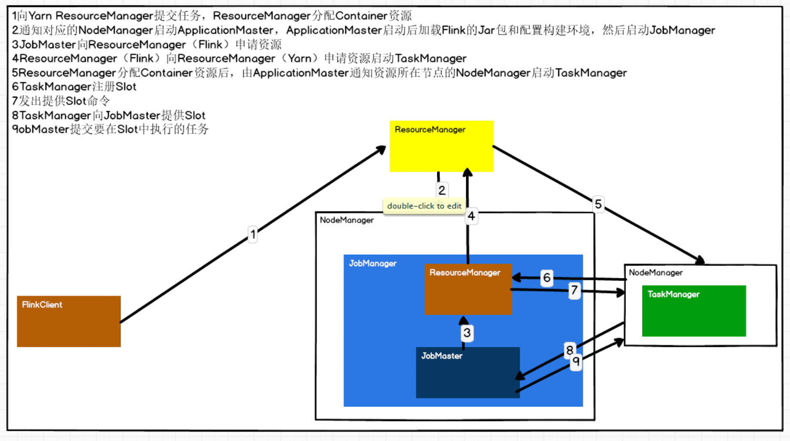
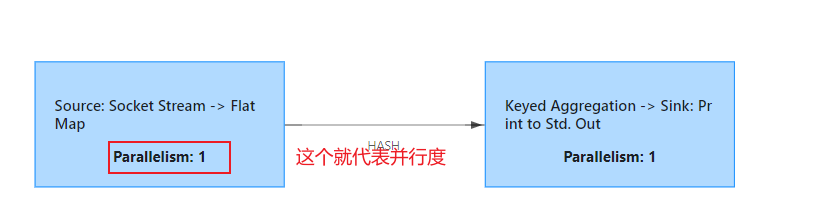
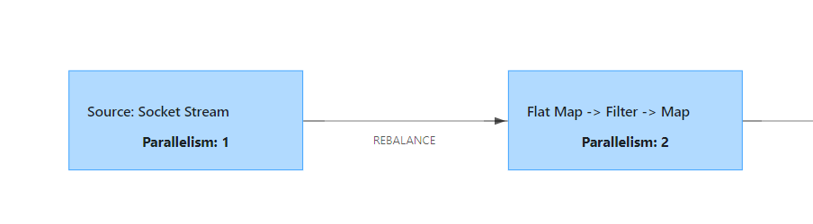
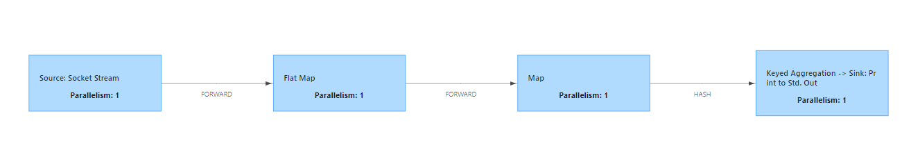
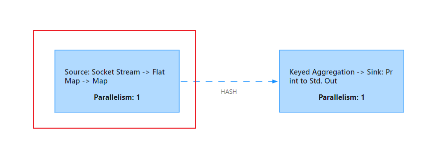
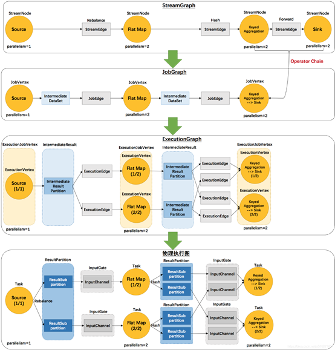

# 	1.session-cluster
    特点:需要提前启动flink集群,提前向yarn申请一定的资源,并且常驻,以后的任务都向这里提交
    
    优点:适用于需要频繁提交的小job,并且执行时间都不长,
    
    缺点:如果提交的作用有需要长时间作业的大job,则会占用该flink的所有资源,后续的job则无法继续提交


    使用方式:
    1.bin/yarn-session.sh -d   (提前启动一个flink集群)
    2.bin/flink run -c 全类名 jar(如果不指定yarn-session集群,会自动寻找也可以使用Dyarn.application.id=application_XXXX_YY 指定启动的flink集群)

# 2.per-job-cluster
    特点:每次提交job,都会重新向yarn申请资源,创建一个新的flink集群,并且任务结束后释放资源,不会影响别的job的执行
    
    优点:适用于需要长时间作业的大job
    缺点:每次提交job都会申请和释放资源,会占用一定的时间
    
    生产环境中使用:per-job-cluster
    
    使用方式:
    bin/flink run -d -t yarn-per-job -c 全类名 jar (旧版提交)
    
    提交任务到其他队列
    bin/flink run -d -m yarn-cluster -yqu hive -c 全类名 jar(旧版提交)
    
    bin/flink run -d -t yarn-per-job -Dyarn.application.queue=hive -c 全类名 jar(新版提交)
# 3.Application-mode-cluster
    原理与per-job-cluster一样
    区别:Application-mode-cluster的main函数执行在集群上
    
    使用方式:
    bin/flink run-application -t yarn-application -c 全类名 jar
    
    提交任务到其他队列
    bin/flink run-application -t yarn-application -Dyarn.application.queue=hive -c 全类名 jar


# 4.yarn模式高可用和standalone高可用的区别
```
区别:
yarn模式:只启动一个,当他挂了,yarn会在别的节点上再次启动一个
standalone模式:同时启动多个JobManager,一个为leader,其他的为standby,leader挂掉,其他的中一个会成为leader

yarn模式高可用的原理:
在yarn-site.xml设置的是尝试次数(上限),flink-conf.xml中的值应该小于他,只有在一定的时间内尝试次数大于设置的上限时,才会真正挂掉  
```

 

# 5.flink架构组成
```
客户端
JobManager:程序的主进程
    ResourceManager:flink资源的管理者
    Dispatcher:接收用户提交的作业,为新的作业启动一个JobMaster,该组件不是必须的,取决于应用提交的方式
    JobMaster:每个job任务的老大
TaskManager:flink的工作进程,每个TaskManager包含了多个slots,slots的数量限制能够执行的任务数量
```


# 6.job提交流程



# 7.核心概念

## 7.1 TaskManager和slots

```
TaskManager:flink中每一个worker就是一个taskManager,可以执行多个task

slot:内存资源的子集,每个taskManager至少有一个slot,多个slot平分taskManager管理的内存资源,但是他们共享一个cpu
注意点:
	1.slot在job内部可以共享,因为计算任务是一步一步执行的
	2.slot会平分taskManager的内存资源,从而达到内存隔离的作用,但是cpu是共享的
```

##  7.2 Parallelism(并行度)



```
1.一个任务的并行度等于这些所有算子中最大的并行度
2.如果空闲的slot个数小于并行度个数,那么任务就会阻塞,一直处于create的状态,除非满足了资源才会继续进行
3.并行度的优先级
算子指定>env全局设置>提交参数>配置文件
```



<p style="color:red;">注意:socket stream有且只有一个并行度</p>

## 7.3 Task与subTask





```
原来的流程是  socket->flatMap->Map->sum->print  四个task,但是经过任务链的优化变成了
socket->flatMap->map  sum->print 变成了只有两个task
```

<p style="color:red;">注意:一个并行度的蓝框等于一个task</p>

## 7.4 任务链

```
stream在算子间的传输数据形式分两种:one-to-one,redistributing

one-to-one:只要满足一进一出,不涉及分区的都属于这种形式,而且并行度必须相同,如果并行度不同也不能分到同一个subTask中

redistributing:设置到重新分区的都是数据这种形式,这种形式无法单独为这种类型的算子设置并行度
```

```
任务链的操作
	算子.startNewChain() --> 与前面的断开链接
	算子.disableChaining() --> 前后都断开链接
	env.disableOperatorChaining() -->全局所有算子都不进行链接
```


```
任务链的优缺点
	优点:减少了线程间的切换,与数据间的交换,减少的数据延迟的同时提升了吞吐量
		例如: 一个任务2个并行度 A 线程执行flatMap B线程执行map
		在A线程执行完flatMap后需要将数据交换给B线程继续进行计算,使用任务链,就可以避免这种操作,直接由A线程操作完flatMap之后直接继续操作Map算子
		
	缺点:如果在链接中的算子中,有一个算子的压力特别大,会拖累在任务链中的其他算子,此时就可以将这个算子单独断链,成为单独的一个,减小整体的压力	
	
```

```
共享组
	默认只有一个共享组,在共享组内共享slot,所有slot的个数等于最大并行度
	
使用 算子.slotSharingGroup("group1")会开辟新的共享组,此时slot的个数等于多个共享组,各个共享组最大并行度之和

例如:两个共享组,每个共享组的最大并行度为1  那么slot的个数为1+1=2
```


## 7.5 执行图



# 8.自定义算子和source函数时,关注富函数

```java
//什么叫富函数:包含声明周期方法的抽象方法,普通函数不含有声明周期方法

//以FlatMap算子为例:
public abstract class RichFlatMapFunction<IN, OUT> extends AbstractRichFunction implements FlatMapFunction<IN, OUT>
    
//自定义flatMap 富函数
public static class MyFlatMapFunction extends RichFlatMapFunction<String,String>{
    
    @Override
    public void open(Configuration parameters) throws Exception {
        System.out.print("open......")
    }
    
    @Override
    public void flatMap(String value, Collector<String> out) throws Exception {
        String[] list = value.split(" ");
        for (String word : list) {
            out.collect(word);
        }
    }
    
    @Override
    public void close() throws Exception {
        System.out.print("close......")
    }
} 
```

```
注意点:
	1.每个并行实例都会执行声明周期方法,一个并行度执行一次open,close  两个并行度执行两次open
	2.读文件时 会执行两次close 一次open
	3.富函数中独有的方法getRuntimeContext()可以获得累加器等参数
```


# keyBy算子

```
keyBy算子经过了两次hash
	第一次 key.hashCode()作为参数传入computeKeyGroupForKeyHash(int keyHash)
	第二次 MathUtils.mumurHash(keyHash) % maxParallelism
	
默认最大	maxParallelism为 
```

# 9.执行模式

```
三种执行模式:
	BATCH:批处理,仅用于有界数据
	STREAMING(默认):即可也以用在有界数据,也可以用在无界数据
    AUTOMATIC:自动选择
    
配置方式:
	1.代码设置
	env.setRuntimeMode(RuntimeExecutionMode.BATCH);
	2.命令行设置
	bin/flink run -Dexecution.runtime-mode=BATCH 
	
推荐使用命令行设置,更加灵活	
```

```
有界数据使用 STREAMING和BATCH的区别
 STREAMING:会打印每一次的结果
 BATCH:没有中间过程,直接输出最终结果
```


