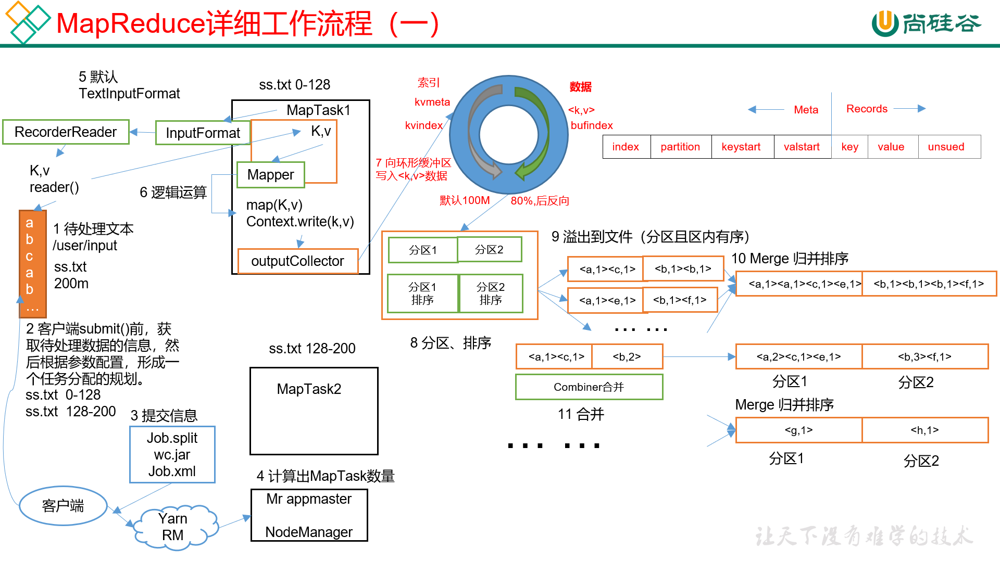
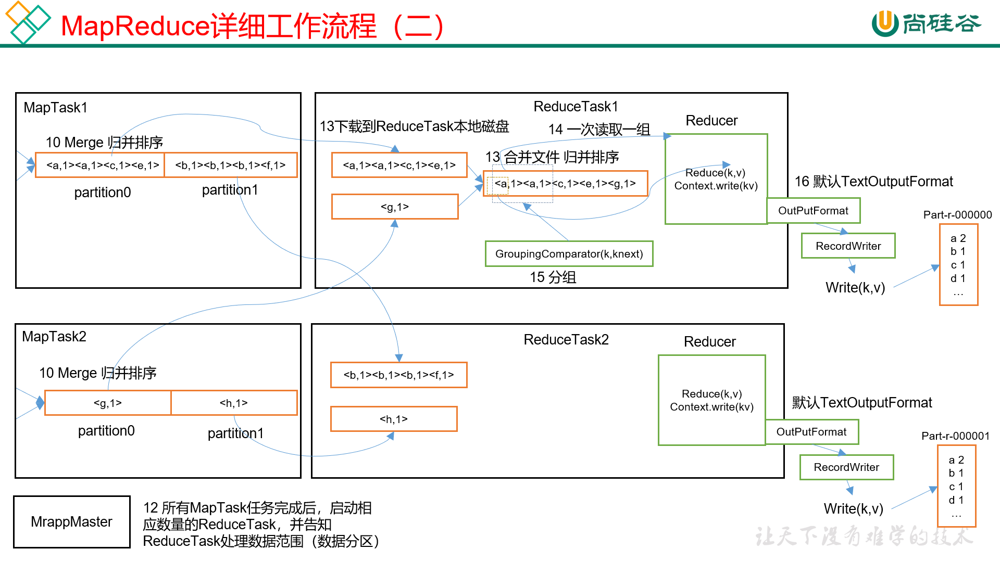
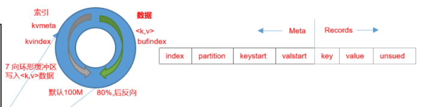

# MapReduce工作机制



# 1.shuffle流程
## 1.map处理后的数据写入环形缓冲区
### 1.1环形缓冲区

```txt
    1.环形缓冲区默认大小为100M
    2.分为两块,一块索引区,一块数据区
    索引区:
        index:对应数据在索引区的索引
        partition:对应数据的分区
        keystart:对应数据的key
        valstart:对应数据的值的起始点
    数据区:
        key,val   
```
### 1.2环形缓冲区的工作原理
```txt
map处理后的数据先正向写入环形缓冲区,在索引满了(1M)或数据(100M*0.8)占用到达80%占用时
    1.在环形缓冲区内对这些数据的索引进行分区且排序,然后溢出到文件写入磁盘(分区且区内有序,但是在同一个溢出文件中),排序方式为快速排序
    2.同时在缓冲区内map写入的数据从剩余的20%开始反向写入,当写入碰到写出时,睡眠等待写出
多个溢出文件,合并,归并排序为一个大的溢出文件    
```

### 1.3可选流程combiner
```txt
    将每一个mapTask的溢出文件提前进行归并排序从(a,1)(a,1)(a,1)(b,1)的形式
变成(a,3)(b,1)的形式,默认合并10个文件,最后将所有的文件合并成一个(a,3)(b,1)的形式的大文件,可选压缩,写入磁盘
```

### 1.4reduceTask复制
```txt
reduceTask默认一个G,从各个mapTask处把分区数据复制回来,读取在内存中,如果内存不够溢出到磁盘,根据对应的分区做归并排序,然后按照key分组,发送给reduce方法
```

# 总结:
## 1.MapTask
```txt
    （1）Read阶段：MapTask通过InputFormat获得的RecordReader，从输入InputSplit中解析出一个个key/value。
    （2）Map阶段：该节点主要是将解析出的key/value交给用户编写map()函数处理，并产生一系列新的key/value。
    （3）Collect收集阶段：在用户编写map()函数中，当数据处理完成后，一般会调用OutputCollector.collect()输出结果。在该函数内部，它会将生成的key/value分区（调用Partitioner），并写入一个环形内存缓冲区中。
    （4）Spill阶段：即“溢写”，当环形缓冲区满后，MapReduce会将数据写到本地磁盘上，生成一个临时文件。需要注意的是，将数据写入本地磁盘之前，先要对数据进行一次本地排序，并在必要时对数据进行合并、压缩等操作。
    溢写阶段详情：
    步骤1：利用快速排序算法对缓存区内的数据进行排序，排序方式是，先按照分区编号Partition进行排序，然后按照key进行排序。这样，经过排序后，数据以分区为单位聚集在一起，且同一分区内所有数据按照key有序(注意排的是索引)。
    步骤2：按照分区编号由小到大依次将每个分区中的数据写入任务工作目录下的临时文件output/spillN.out（N表示当前溢写次数）中。如果用户设置了Combiner，则写入文件之前，对每个分区中的数据进行一次聚集操作。
    步骤3：将分区数据的元信息写到内存索引数据结构SpillRecord中，其中每个分区的元信息包括在临时文件中的偏移量、压缩前数据大小和压缩后数据大小。如果当前内存索引大小超过1MB，则将内存索引写到文件output/spillN.out.index中。
    （5）Merge阶段：当所有数据处理完成后，MapTask对所有临时文件进行一次合并，以确保最终只会生成一个数据文件。
    当所有数据处理完后，MapTask会将所有临时文件合并成一个大文件，并保存到文件output/file.out中，同时生成相应的索引文件output/file.out.index。
    在进行文件合并过程中，MapTask以分区为单位进行合并。对于某个分区，它将采用多轮递归合并的方式。每轮合并mapreduce.task.io.sort.factor（默认10）个文件，并将产生的文件重新加入待合并列表中，对文件排序后，重复以上过程，直到最终得到一个大文件。
    让每个MapTask最终只生成一个数据文件，可避免同时打开大量文件和同时读取大量小文件产生的随机读取带来的开销。

```

## 2.Reducer
```txt
    （1）Copy阶段：ReduceTask从各个MapTask上远程拷贝一片数据，并针对某一片数据，如果其大小超过一定阈值，则写到磁盘上，否则直接放到内存中。
    （2）Merge阶段：在远程拷贝数据的同时，ReduceTask启动了两个后台线程对内存和磁盘上的文件进行合并，以防止内存使用过多或磁盘上文件过多。
    （3）Sort阶段：按照MapReduce语义，用户编写reduce()函数输入数据是按key进行聚集的一组数据。为了将key相同的数据聚在一起，Hadoop采用了基于排序的策略。由于各个MapTask已经实现对自己的处理结果进行了局部排序，因此，ReduceTask只需对所有数据进行一次归并排序即可。
    （4）Reduce阶段：reduce()函数将计算结果写到HDFS上。

```
