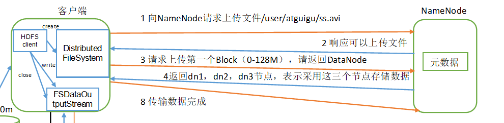
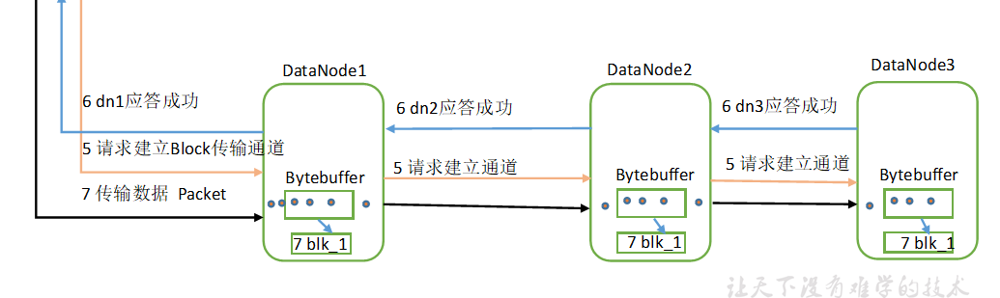

# 1.hdfs文件块大小
hadoop1.x   64MB
hadoop2.x,hadoop3.x 128MB

文件块的大小可以配置属性dfs.blocksize设置

为什么文件块的大小不能太大,也不能太小
1.块设置太小,会增加寻址时间
2.块设置太大,磁盘传输时间会明显大于定位块位置的时间,导致处理数据时慢
总结:hdfs的快大小设置主要取决于磁盘的传输速率

# 2.hdfs的写数据流程
源码解析：org.apache.hadoop.hdfs.DFSOutputStream
## 2.1建立连接
	1.客户端通过分布式文件系统(Distributed FileSystem)向namenode请求上传数据
	2.namenode响应是否可以上传数据
	3.准备上传第一个文件块,请求namenode返回上传的节点信息
	4.根据副本数,与节点距离返回节点信息

## 2.2数据传输
	1.客户端与节点建立连接

	client--请求建立通道-->node1--请求建立通道-->node2--请求建立通道-->node3
	client <--节点1响应-- node1<---节点2响应----node2<--节点三响应----node3
	2.开始数据传输

Q1:上传数据先切分还是先上传
先切分,因为先切分只需要切分一次,但是如果上传的话,根据副本的个数不同还需要切分多次

Q2:传输数据是单节点传输还是多节点同时传输
单节点传输,客户端向一个节点传输数据,同时该节点向下一个节点传输.因为并行传输的话,并发太高,同时数据的安全无法保证,而且需要等待所有节点传输完,浪费时间

比如老师发视频:
	1.老师---------->所有学生

	2.老师------组长------组员
### 1.上传节点的选择
返回的就是namenode根据副本策略选择的节点

### 2.副本放置策略
副本数默认为3
1.如果在本地计算机上,则本地上必须放一个,如果不在本地上,则随机挑选一个
2.副本2则是放置在远程机架的另一个节点上
3.副本3放在远程机架的不同节点上(与副本2在同一个机架上)
4.如果副本数大于3，则每个机架的副本数量((副本-1)/机架+2)的同时，
随机确定第4个及更多副本的位置。
### 3.数据传输过程
上传数据通过字节流写入,该数据被分解为无数个数据包(packet),每个包大小为64kb,包又由数据块(ckunk)组成,每个块大小为512b+4b的校验和组成,当包填满数据时,就会进入dataQueue(队列)中等待,DataStreamer线程把数据包发送给第一个datanode节点,然后将数据包从dataQueue中放入ackQueue(队列),datanode返回收到数据包的确认ack,ResponseProcessor一旦获取到所有成功的ack就会把ackQueue中的所有数据包删除,只要有一个ack发生错误,就把发生错误的节点剔除出去,并且将数据包从ackQueue中拿回dataQueue,然后把剩下的节点建立新的管道,从错误的ack数据包开始重新发送

# 3.hdfs的读数据流程
	1.客户端发送下载请求
	2.namenode查询元数据,返回datanode地址
	3.根据就近原则选择datanoe读取数据
	4.datanode开始传输数据
	5.客户端接受数据,先在本地缓存,然后写入目标文件

# 4.nn和2nn的工作机制
nn:存储元数据
2nn:给nn合并fsimage和edits文件

nn下的文件角色
name文件下
	fsimage:包含所有hdfs的文件和目录的序列化信息
	edits:hdfs的更新(写)操作
	seen_txid:保存最新的edits文件

每次nn启动的时候就会将fsimage读入内存,然后加载edits的更新操作

工作原理:nn在内存中存储并运行元数据,但是只在内存中存储是不安全的,一旦断电,整个集群将无法继续工作,所以为了安全,在nn的本地磁盘也保存了一份元数据,但是hdfs文件系统不支持对文件的随机修改,只支持追加写,所以本地磁盘的元数据就由fsimage(元数据)+edits(操作组成), 一旦集群发生操作,就先向edits中追加操作,然后修改内存中的元数据.但是集群的数据量是很大的,edits文件一旦太大就将影响效率,同时nn如果由自己进行fsimage与edits的合并是不合理的,因为nn本身就要消耗极大的内存,所以引入的2nn来帮助nn进行fsimage与edits的合并,2nn将nn的edits与fsimage拷贝到自己身上进行合并,然后再拷贝回去

2nn的合并机制(CheckPoint):
	1.每个一个小时合并一次
	2.当edits的数据量到达100w次后进行合并
	3.当2nn进行合并时,nn会将edits进行滚动,生成一个新的文件继续接受集群的操作

## 1.如果nn 的元数据信息被误删除,可以把2nn 的数据考过来,但是会丢失一部分数据

# 5.集群安全模式
安全模式:可以预览,可以下载,但是不能上传
	1.nn启动的时候会开始加载合并fsimage和edits,一旦合并完成后,会创建新的fsimage和edits,这个过程一直运行在安全模式
	2.nn维护着元数据,但是不存储数据,在安全模式下,各个datanode向nn发送最新的块列表信息,如果块信息缺少大于等于2个,则不会退出安全模式,如果块信息不缺少或只少一个则在30s后退出安全模式
	3.如果启动后不能退出安全模式,是因为缺少2个及以上的块信息,此时需要手动退出安全模式,页面会显示缺少的块信息

安全模式命令:
bin/hdfs dfsadmin -safemode get		（功能描述：查看安全模式状态）
bin/hdfs dfsadmin -safemode enter  	（功能描述：进入安全模式状态）
bin/hdfs dfsadmin -safemode leave	（功能描述：离开安全模式状态）
bin/hdfs dfsadmin -safemode wait	（功能描述：等待安全模式状态）

# 6.datanode工作机制
	1.数据块在datanode上以文件的形式存储,包括两个文件,
	blk_xxxxxx(数据本身) 和blk_xxxxxxx.meta(包函数据的长度,校验和,时间戳)
	2.datanode启动后,向namenode注册,通过后,定时向namenode报告块信息,默认为6个小时 dfs.blockreport.intervalMsec
	3.每隔3s(心跳时间) namenode询问datanode是否存活,如果超过心跳时间,不会马上认为该datanode死亡 ,而是会等待10分钟+30s

心跳重新检查间隔:dfs.namenode.heartbeat.recheck-interval默认为300000ms
心跳时间:dfs.heartbeat.interval默认为3s
datanode主动报告间隔:dfs.blockreport.intervalMsec默认6个小时

# 7.添加新节点
只需要在添加一台服务器,配置好配置文件,启动datanode就可以
hdfs --daemon start datanode(启动datanode)
hdfs --daemon start nodemanager(启动nodemanager)

# 8.删除旧的节点
把相对应的节点添加进黑名单,但是有黑名单的前提是在白名单内,一般白名单是在集群搭建之初就考虑好的

白名单和黑名单都需要分发到所有节点
##  1.创建白名单 
	vim /opt/module/hadoop-3.1.3/etc/hadoop/whitelist
## 	2.添加服役节点
	hadoop101
	hadoop102
	...

##  3.创建黑名单,添加黑名单后不需要重启集群,只要刷新namenode,ResourceManager
	vim /opt/module/hadoop-3.1.3/etc/hadoop/blacklist
##  4.添加退役节点
	hadoop104
##  5.刷新namenode,ResourceManager	 
	hdfs dfsadmin -refreshNodes
	yarn rmadmin -refreshNodes

注意点:如果节点数小于等于副本数是不能退役的

# 9.如何确保数据的完整性
1.当datanode读取block的时候,他会计算Checksun(校验和)如果计算后的校验和与创建时候的校验和不一致,说明blokc已经损坏
2.当数据上传,下载,上传完成落盘都会进行校验,在datanode磁盘上的block每隔6小时也会进行一次校验
3.常见的校验算法crc,md5(128),shal(160)以及最简单的奇偶校验

# 10.配置namenode和datanode多目录需要重启集群,所以应该在集群搭建的时候考虑好
	删除所有节点的data 和logs,重新格式化namenode和启动集群

