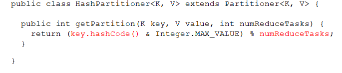

# 1.分区原理

默认为0号分区

# 2.自定义分区
```java
//1.声明一个类继承Partitioner类,[K,V对应mapper的输出K,V]
public class TestPartitioner extends Partitioner<K,V>{
    //2.重写分区方法
    @Override
    public int getPartition(PartBean partBean, Text text, int numPartitions) {
        //3.重写分区规则,例如
        String prePhone = text.toString().substring(0, 3);
        if ("136".equals(prePhone)) {
            return 0;
        } else if ("137".equals(prePhone)) {
            return 1;
        } else if ("138".equals(prePhone)) {
            return 2;
        } else if ("139".equals(prePhone)) {
            return 3;
        } else{
            return 4;
        }
    }
}
//4.在main方法中声明,分区数量,以及自定义分区
job.setPartitionerClass(PartPartitioner.class);
job.setNumReduceTasks(5);
```

# 3.分区总结
当分区数为1时,不走自定义分区,只会生成一个分区文件
当分区数大于自定义分区规则中的分区数,则会产生一部分的空文件
当分区数不足自定义分区规则中的分区数,则会报异常