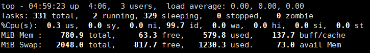

```查看所有进程
ps	:进程状态
ps -aux | grep xxx:查看所有进程匹配xx

ps -aux显示信息说明
	USER：该进程是由哪个用户产生的
	PID：进程的ID号
    %CPU：该进程占用CPU资源的百分比，占用越高，进程越耗费资源；
    %MEM：该进程占用物理内存的百分比，占用越高，进程越耗费资源；
    VSZ：该进程占用虚拟内存的大小，单位KB；
    RSS：该进程占用实际物理内存的大小，单位KB；
    TTY：该进程是在哪个终端中运行的。其中tty1-tty7代表本地控制台终端，tty1-tty6是本地的字符界面终端，tty7是图形终端。pts/0-255代表虚拟终端。
    STAT：进程状态。常见的状态有：R：运行、S：睡眠、T：停止状态、s：包含子进程、+：位于后台
    START：该进程的启动时间
    TIME：该进程占用CPU的运算时间，注意不是系统时间
    COMMAND：产生此进程的命令名


ps -ef|grep xxx:查看父子进程
ps -ef显示信息说明
    UID：用户ID 
    PID：进程ID 
    PPID：父进程ID 
    C：CPU用于计算执行优先级的因子。数值越大，表明进程是CPU密集型运算，执行优先级会降低；数值越小，表明进程是I/O密集型运算，执行优先级会提高 
    STIME：进程启动的时间 
    TTY：完整的终端名称 
    TIME：CPU时间 
    CMD：启动进程所用的命令和参数

```

```shell
kill -9 进程号 :强制杀死进程
killall 进程名(这在系统因负载过大而变得很慢时很有用)
pstree
	-p:显示进程的ID
	-u:显示进程的所属用户
```

```shell
top
	-d:指定top命令每隔几秒更新。默认是3秒在top命令的交互模式当中可以执行的命令：
	-i:使top不显示任何闲置或者僵死进程。
	-p:通过指定监控进程ID来仅仅监控某个进程的状态
	
执行命令后,可以用下列排序	
P	以CPU使用率排序，默认就是此项 
M	以内存的使用率排序
N	以PID排序
q	退出top
	
第一行信息为任务队列信息
    12:26:46	系统当前时间
    up 1 day, 13:32	系统的运行时间，本机已经运行1天
    13小时32分钟
    2 users	当前登录了两个用户
    load  average:  0.00, 0.00, 0.00	系统在之前1分钟，5分钟，15分钟的平均负载。一般认为小于1时，负载较小。如果大于1，系统已经超出负荷。
    
第二行为进程信息
    Tasks:  95 total	系统中的进程总数
    1 running	正在运行的进程数
    94 sleeping	睡眠的进程
    0 stopped	正在停止的进程
    0 zombie	僵尸进程。如果不是0，需要手工检查僵尸进程
    
第三行为CPU信息
    Cpu(s):  0.1%us	用户模式占用的CPU百分比
    0.1%sy	系统模式占用的CPU百分比
    0.0%ni	改变过优先级的用户进程占用的CPU百分比
    99.7%id	空闲CPU的CPU百分比
    0.1%wa	等待输入/输出的进程的占用CPU百分比
    0.0%hi	硬中断请求服务占用的CPU百分比
    0.1%si	软中断请求服务占用的CPU百分比
    0.0%st	st（Steal  time）虚拟时间百分比。就是当有虚拟机时，虚拟CPU等待实际CPU的时间百分比。

第四行为物理内存信息
    Mem:    625344k total	物理内存的总量，单位KB
    571504k used	已经使用的物理内存数量
    53840k free	空闲的物理内存数量，我们使用的是虚拟机，总共只分配了628MB内存，所以只有53MB的空闲内存了
    65800k buffers	作为缓冲的内存数量
    	
第五行为交换分区（swap）信息
    Swap:   524280k total	交换分区（虚拟内存）的总大小
    0k used	已经使用的交互分区的大小
    524280k free	空闲交换分区的大小
    409280k cached	作为缓存的交互分区的大小
	
```



```shell
netstat 
	-n:拒绝显示别名，能显示数字的全部转化成数字
	-l:仅列出有在listen（监听）的服务状态
	-p:表示显示哪个进程在调用
	
	netstat -anp |grep 进程号	（功能描述：查看该进程网络信息）
	netstat -nlp	| grep 端口号	（功能描述：查看网络端口号占用情况）

```

