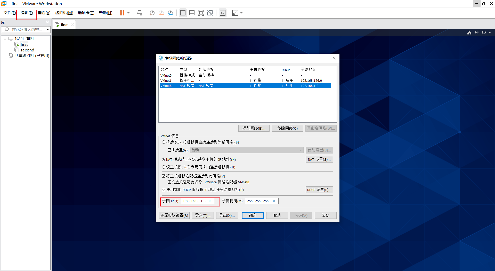
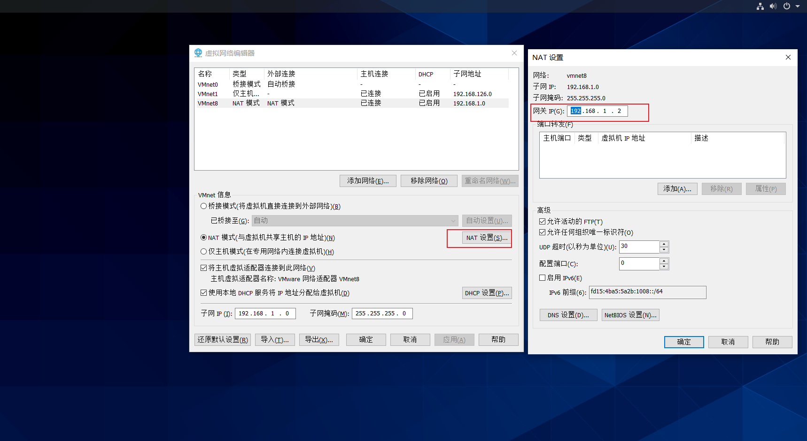
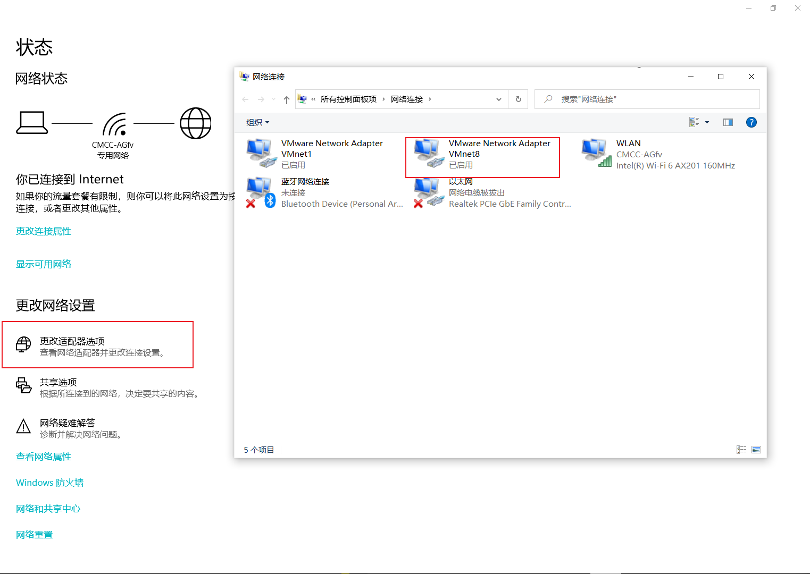
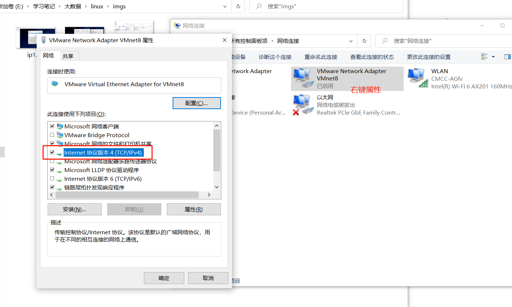
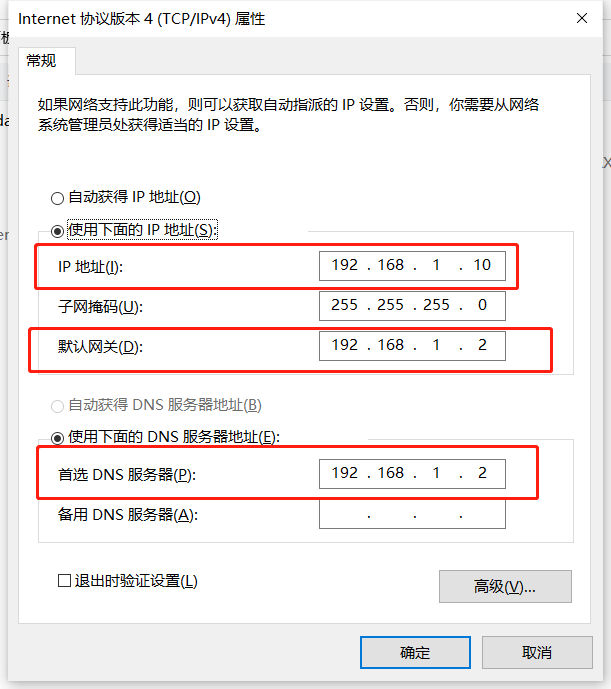
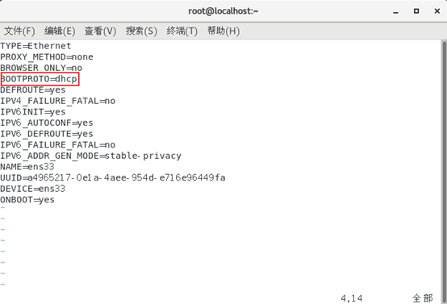

# 1.修改虚拟网络编辑器中的ip和网关


# 2.修改windows的vware虚拟网卡的ip地址



# 3.设置linux的静态ip
vim /etc/sysconfig/network-scripts/ifcfg-ens33

```html
#IP的配置方法[none|static|bootp|dhcp]（引导时不使用协议|静态分配IP|BOOTP协议|DHCP协议）
BOOTPROTO=static      
#IP地址
IPADDR=192.168.1.100   
#网关  
GATEWAY=192.168.1.2      
#域名解析器
DNS1=192.168.1.2
```
# 4.重启网络或者重启linux系统


