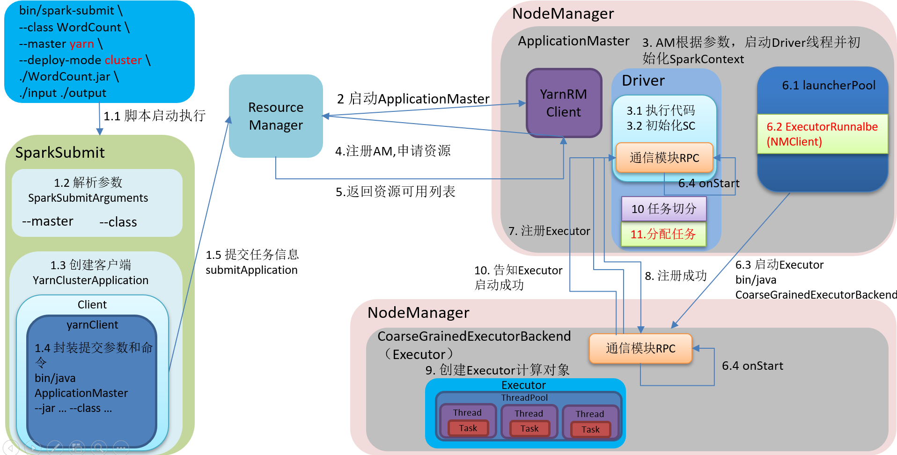
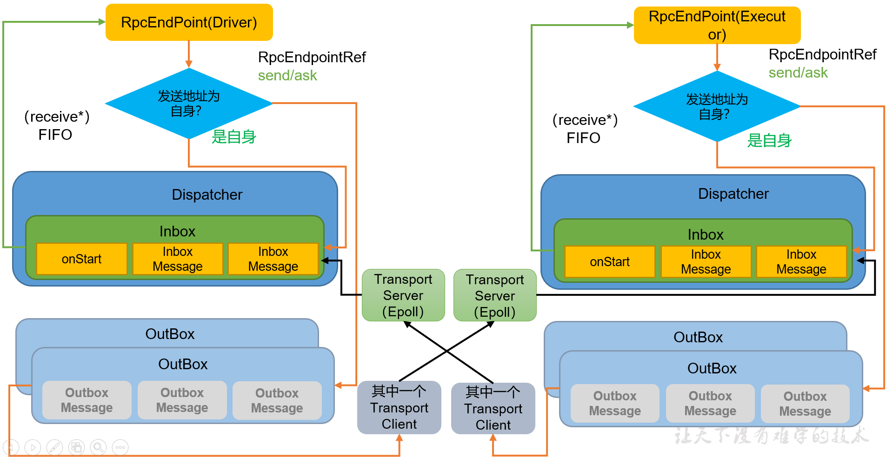
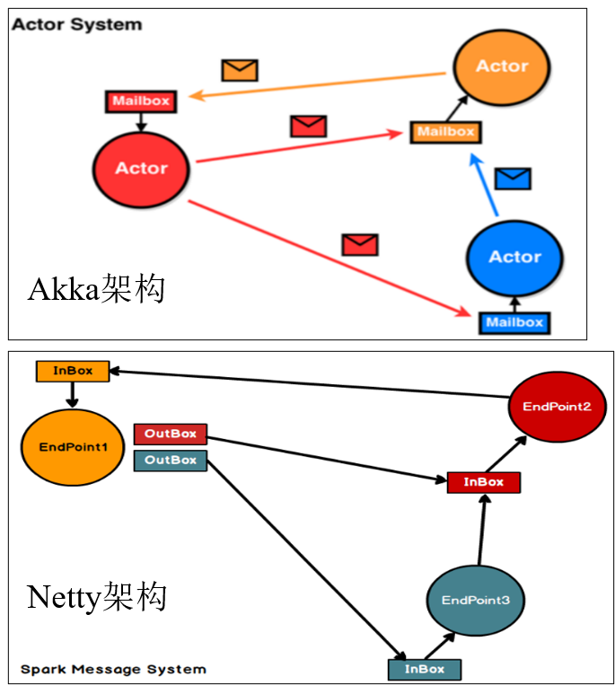

# 1.spark任务提交流程
```
1.bin/spark-submit 
 1.1 提交任务
 1.2 解析参数
 1.3 创建yarnClusterApplication客户端
 1.4 在yarnClusterApplication客户端中创建yarnClient客户端封装提交的参数
 1.5 提交任务信息给ResourceManager
2.yarn ResourceManager 启动ApplicationMaster
3.AM 根据提交的参数启动Driver线程
 3.1 在Driver线程中初始化SparkContext
4.向ResourceManager 注册AM,并且申请任务执行的资源
5.ResourceManager返回资源列表
6.在launcherPool启动池中,ExecutorRunable通知NMClient(NodeManager),启动CoarseGrainedExecutorBacked(Executor对象)
7.通过RPC通信模块,向Driver注册Executor
8.Driver返回注册成功消息
9.创建Executor计算对象
10.通知Dirver Executor启动成功
11.Driver进行任务切分,分配任务
```



# 2.spark通信架构



```
角色:
	RpcEndPoint:rpc通信终端,终端的生命周期 contructor->onStart->recevie*->onStop
	dispatcher:消息调度器,根据指令的接受方不同,放入收件箱或发件箱
	inBox:收件箱
	outBox:发件箱
	RpcEndpointRef:远程RpcEndpoint终端的引用,类似手机号
		send:单纯只发送,不关心是否回复
		ask:发送收到后,需要返回消息
	TransportClient:Netty通信客户端,一个outBox对应一个TransportClient
	TransportServer:Netty通信客户端,一个RpcEndPoint对应一个TransportServer
	
通信流程:A终端向B终端发送send消息
	1.A终端先经过RpcEndpointRef引用,生成带有引用的消息
	2.消息经过dispatcher消息调度器,发往发件箱outBox
	3.这些消息经过TransportClient发往对应的TransportServer
	4.TransportServer把这些消息经过dispatcher调度器,发放收件箱inBox
	5.inBox经过receive*的相应方法通知终端RpcEndPoint
```

# 3.spark通信组件的发展

```
1.spark早期采用AKKa作为通信组件
2.spark1.3引入Netty,为了解决shuffle的大数据传输问题
3.spark1.6 Akka和Netty同时存在,Netty完全实现了Akka在spark的功能
4.spark2.x以后,spark抛弃了Akka,使用Netty
```

<p style="color:red;">Akka和Netty架构比较:</p>



```
Akka:收发消息都使用同一个,相当于同时读写
Netty:发消息用InBox,收消息用OutBox,收发分离,相当于读写分离,同时Inbox只有一个,但是OutBox有多个
```

<p style="color:red;">拓展:三种通信方式</p>

```
BIO	:阻塞式IO
NIO	:非阻塞式IO
AIO	:异步非阻塞式IO

注意:
	Linux对AIO支持不够好,Netty使用Epoll来模仿AIO,Netty支持NIO和AIO,但是默认使用NIO
```

# 4.shuffle原理

```
spark的shuffle 使用的是bypassShuffle,与hadoop的shuffle使用的是同一个
```

# 5.任务划分

```
application:一个sc就是一个application
job:一个行动算子就是一个job
stage:stage个数是shuffle的个数+1
task:是不走shuffle的最后一个算子的分区数

application==>job=====>stage=====>task
```