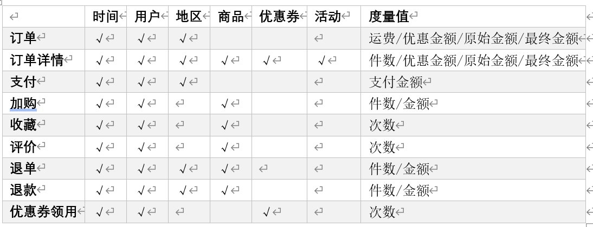

# 数仓分层
## ODS:
    1.保持数据不变,起到备份数据的作用
    2.采用lzo压缩,减少磁盘空间
    3.创建分区表,防止全表扫描
    4.创建外部表
## DIM,DWD:
    DIM,DWD:进行维度建模
    将所有的表进行事实表和维度表区分

    维度建模的准则:
        1.选择业务线,一个业务线对应一个事实表
        2.声明粒度,一行数据保存的细化程度,应尽量选择最小粒度
        3.确定维度,维度主要是对业务事实的描述,主要表现在谁,何时,何地,等等描述;比如订单表示事实表,
        对订单表进行描述,谁在什么时候下了订单,这里就有两个维度,谁->用户维度,什么时候->时间维度;

        确定维度的原则是:是否需要统计什么时间下单人数最多,那个地区下单的数量最多
        4.确定事实,事实指的是业务中的度量值,如订单事实表,度量值为订单个数,订单金额等

    DIM:进行维度表的建模(该维度表存储所有与自己相关的字段)
    以商品维度为例:存储所有与商品有关联的字段,商品SKU表、商品一级分类、商品二级分类、商品三级分类、品牌表、商品SPU表、SKU销售属性表和SKU平台属性表
    注意:其中用户维度需要保存用户的信息的生命周期,需要做成拉链表

    DWD:根据上面选择的事实表和维度表进行维度建模,每个事实表关联那些维度(表字段由维度外键和事实表的度量值组成)
## DWS
## DWT
## ADS

