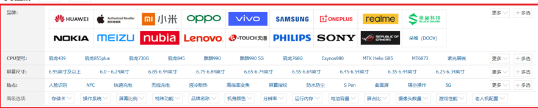
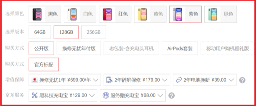
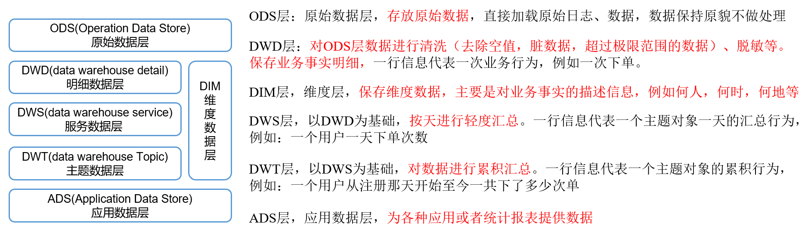

# 1.SKU和SPU
SPU:指代一系列的产品,如AppleXR手机

SKU:指代具体的一种商品,128G+灰色+全网通 AppleXR手机

# 2.平台属性和销售属性
平台属性:

销售属性:

# 3.数仓分层

# 4.数据仓库和数据集市
数据集市是一种微型的数据仓库,只能服务于部分管理人员
数据仓库是企业级的,可以服务于整个公司

# 5.范式
定义:
    设计一张数据表的表结构，符合的标准级别、规范和要求
分类:
    第一范式(1NF)、第二范式(2NF)、第三范式(3NF)、巴斯-科德范式(BCNF)、第四范式(4NF)、第五范式(5NF)。 

# 6.三范式的区分
第一范式:
    属性不可切割,每个数据都是最小不可再分
第二范式:
    不能存在部分函数依赖
    AB->C
    A->C
    c对AB是部分函数依赖
第三范式:
    不能存在传递函数依赖
    A->B->C
    C---X-->A

# 7.维度表和事实表
维度表:
    一般是对事实的描述信息。每一张维表对应现实世界中的一个对象或者概念。    例如：用户、商品、日期、地区等。 
事实表:
    事实表中的每行数据代表一个业务事件（下单、支付、退款、评价等）。“事实”这个术语表示的是业务事件的度量值（可统计次数、个数、金额等）    
