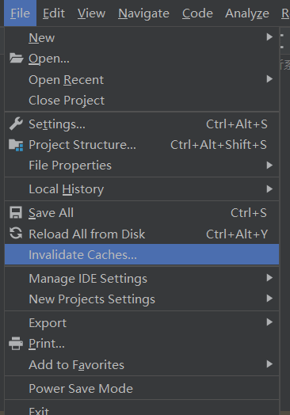

# springboot -plugn依赖无法下载
1.删除所有.lastUpdate结尾的maven文件
2.清除缓存重启IDEA

# springboot plugn打包无法打包项目依赖
 <plugin>
    <groupId>org.springframework.boot</groupId>
    <artifactId>spring-boot-maven-plugin</artifactId>
    <configuration>
    <!-- 项目启动的主类 -->
        <mainClass>com.atguigu.app.JsonMocker</mainClass>
    </configuration>
    <executions>
        <execution>
            <goals>
                <goal>repackage</goal>
            </goals>
        </execution>
    </executions>
</plugin>